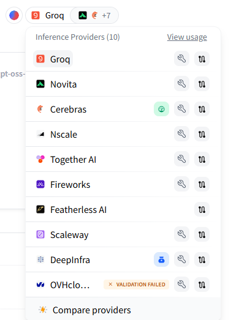
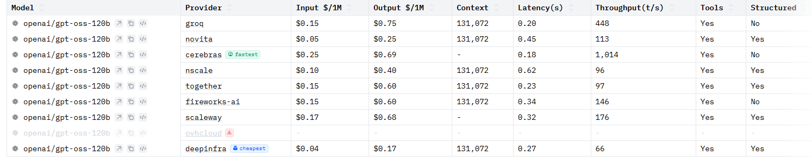
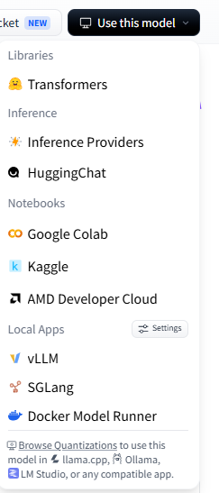

# Model Integration Notes

---

## Model

- Name: GPT-OSS-120B
- Provider(s): Hugging Face Router (Groq, Cerebras, DeepInfra, nscale, Together, Fireworks AI, Scaleway, Novita)
- Primary Provider: Hugging Face Router → Groq
- Backup Provider: Hugging Face Router → Cerebras





---

## API

- Base URL: https://router.huggingface.co/v1
- Model ID: openai/gpt-oss-120b:groq
- OpenAI Compatible? (Y/N): Yes
- API Key Needed: Hugging Face User Access Token
- Env Variable Name: HF_TOKEN or HF_API_KEY

---

## Free Tier

- Available? (Y/N): Yes
- Rate Limits: Subject to Hugging Face Inference Providers free monthly credits and provider-specific limits.
- Notes:
  - Hugging Face Free Tier provides up to $0.10/month of routed inference requests.
  - Multiple inference providers are available through Hugging Face Router.
  - Provider can be changed by modifying only the provider suffix in the model ID.

---

## Model Specs

- Context Window: 131,072 tokens (Groq, nscale, Together, Fireworks AI, DeepInfra)
- Max Output Tokens: Verify during testing
- Streaming Supported? (Y/N): Yes
- Thinking Mode? (Y/N): Yes (Reasoning model)
- Multimodal? (Y/N): No

---

## Python

SDK:
- OpenAI Python SDK

Example:

```python
from openai import OpenAI
import os

client = OpenAI(
    base_url="https://router.huggingface.co/v1",
    api_key=os.environ["HF_TOKEN"],
)

stream = client.chat.completions.create(
    model="openai/gpt-oss-120b:groq",
    messages=[
        {
            "role": "user",
            "content": "What is the capital of France?"
        }
    ],
    stream=True,
)

for chunk in stream:
    print(chunk.choices[0].delta.content, end="")
```

---

## Links

Official Docs:

API Docs:

Models Page:

Pricing / Limits:

---

## Integration Notes

- Authentication:
  - Bearer token using `HF_TOKEN`.
- Anything unusual:
  - Hosted through Hugging Face Router.
  - Supports multiple inference providers including Groq, Cerebras, DeepInfra, Together, Fireworks AI, nscale, Novita and Scaleway.
  - OpenAI-compatible endpoint; same client can be reused.
  - Provider can be switched by changing only the model suffix.
- Parameters to remember:
  - model
  - messages
  - temperature
  - max_tokens
  - stream
- Things to test:
  - Reasoning quality
  - Long-context prompts
  - Streaming
  - RAG context injection
  - Provider switching
  - Latency comparison
  - Error handling

---

## Status

☑ API key created

☐ Test request successful

☐ Streaming tested

☑ Model ID verified

☐ Added to config

☑ Ready for evaluation