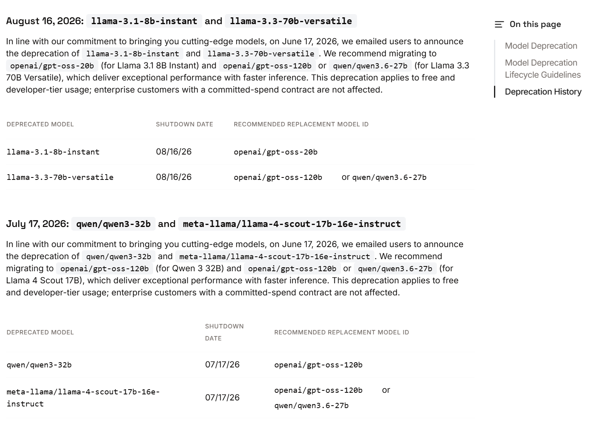
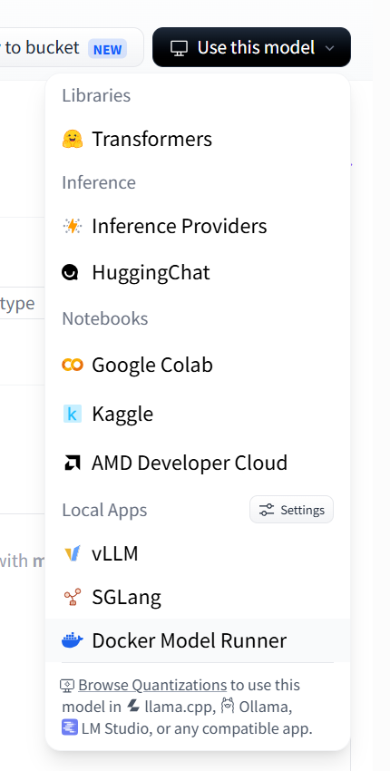
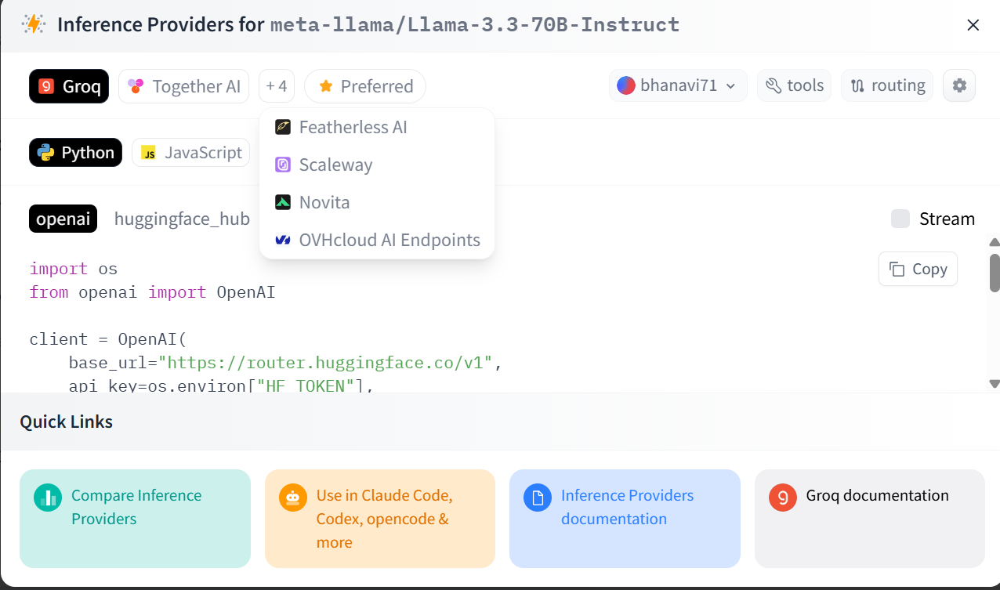
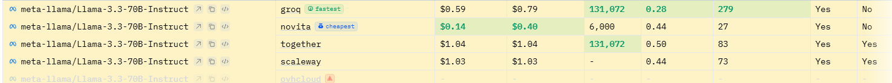

# Model Integration Notes

---

## Model

- Name: Llama 3.3 70B Instruct
- Provider(s): Hugging Face Router (Groq, DeepInfra, nscale*)
- Primary Provider: Hugging Face Router → Groq
- Backup Provider: Hugging Face Router → DeepInfra / nscale (if available)





https://openrouter.ai/meta-llama/llama-3.3-70b-instruct:free?view=api

---

## API

- Base URL: https://router.huggingface.co/v1
- Model ID: meta-llama/Llama-3.3-70B-Instruct:groq
- OpenAI Compatible? (Y/N): Yes
- API Key Needed: Hugging Face User Access Token
- Env Variable Name: HF_TOKEN or HF_API_KEY

---

## Free Tier

- Available? (Y/N): Yes
- Rate Limits: Subject to Hugging Face Inference Providers free monthly credits and provider-specific limits.
- Notes:
  - Hugging Face Free Tier provides up to $0.10/month of routed inference requests.
  - Uses Hugging Face Router; inference provider can be changed by modifying the provider suffix in the model ID.
  - Groq has announced deprecation of direct hosting for Llama 3.3 70B; alternative providers should be preferred for long-term use.

---

## Model Specs

- Context Window: 131,072 tokens (Groq)
- Max Output Tokens: Verify during testing
- Streaming Supported? (Y/N): Yes
- Thinking Mode? (Y/N): No
- Multimodal? (Y/N): No

---

## Python

SDK:
- OpenAI Python SDK

Example:

```python
from openai import OpenAI
import os

client = OpenAI(
    base_url="https://router.huggingface.co/v1",
    api_key=os.environ["HF_TOKEN"],
)

stream = client.chat.completions.create(
    model="meta-llama/Llama-3.3-70B-Instruct:groq",
    messages=[
        {
            "role": "user",
            "content": "What is the capital of France?"
        }
    ],
    stream=True,
)

for chunk in stream:
    print(chunk.choices[0].delta.content, end="")
```

---

## Links

Official Docs:

API Docs:

Models Page:

Pricing / Limits:

---

## Integration Notes

- Authentication:
  - Bearer token using `HF_TOKEN`.
- Anything unusual:
  - Hosted entirely through Hugging Face Router.
  - Inference provider is selected using the model suffix (e.g., `:groq`, `:deepinfra`, `:nscale`).
  - OpenAI-compatible API; existing OpenAI client can be reused without modification.
  - Groq has announced deprecation of direct support for this model; keep provider configurable.
- Parameters to remember:
  - model
  - messages
  - temperature
  - max_tokens
  - stream
- Things to test:
  - System prompts
  - Streaming
  - Long-context prompts
  - RAG context injection
  - Provider switching (`groq` ↔ `deepinfra` ↔ `nscale`)
  - Error handling (invalid model / invalid API key)

---

## Status

☑ API key created

☑ Test request successful

☑ Streaming tested

☑ Model ID verified

☐ Added to config

☑ Ready for evaluation