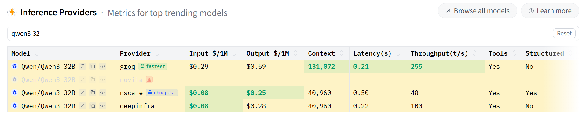
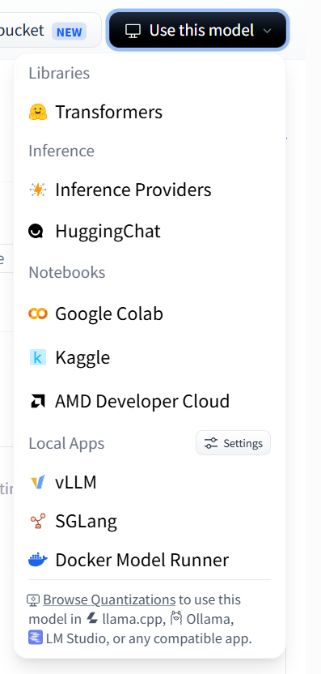
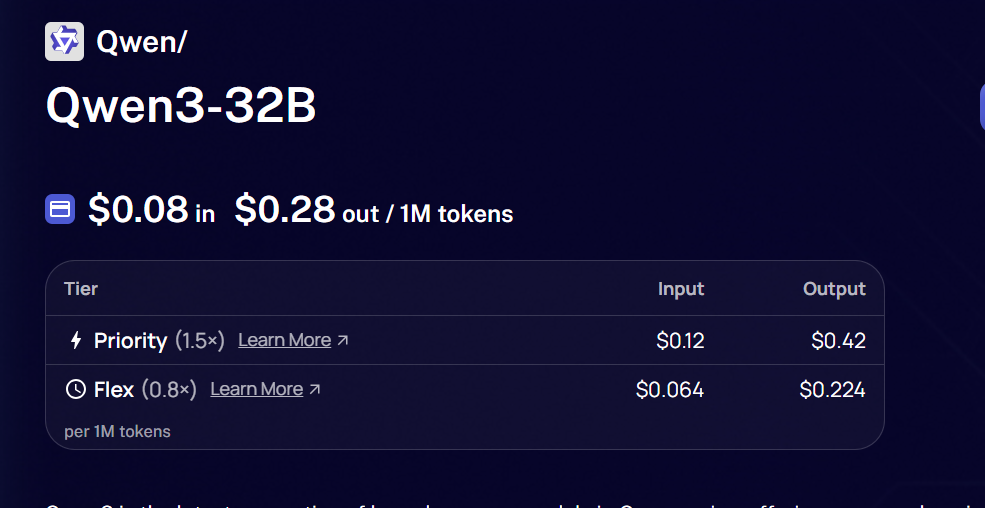

# Model Integration Notes

---

## Model

- Name: Qwen3-32B
- Provider(s): Hugging Face Router (Groq Inference Provider)
- Primary Provider: Hugging Face Router → Groq
- Backup Provider: Hugging Face Router → nscale 3rd-choice (avail only through hf router), deepinfra 2nd-choice (avail through both hf and deepinfra api)
- Available locally through transfrormers library, 




https://deepinfra.com/Qwen/Qwen3-32B
https://langdb.ai/app/providers/deepinfra/

---

## API

- Base URL: https://router.huggingface.co/v1
- Model ID: Qwen/Qwen3-32B:groq
- OpenAI Compatible? (Y/N): Yes
- API Key Needed: Hugging Face User Access Token
- Env Variable Name: HF_API_KEY or HF_TOKEN

---

## Free Tier

- Available? (Y/N): Yes
- Rate Limits: Subject to Hugging Face Inference Providers free monthly credits and provider limits.
- Notes:
  - Up to $0.10/month of routed inference requests on the free tier.
  - Uses Hugging Face Router; compute is provided by Groq.

---

## Model Specs

- Context Window: 131,072 tokens (Groq provider)
- Max Output Tokens: Verify during testing / provider docs
- Streaming Supported? (Y/N): Yes
- Thinking Mode? (Y/N): Yes (Qwen3 reasoning features supported)
- Multimodal? (Y/N): No (Text-only model)

---

## Python

SDK:
- OpenAI Python SDK

Example:

```python
from openai import OpenAI
import os

client = OpenAI(
    base_url="https://router.huggingface.co/v1",
    api_key=os.environ["HF_TOKEN"],
)

response = client.chat.completions.create(
    model="Qwen/Qwen3-32B:groq",
    messages=[
        {"role": "system", "content": "You are a helpful math tutor."},
        {"role": "user", "content": "What is 7 × 8?"}
    ],
)
```

---

## Links

Official Docs:
https://huggingface.co/docs/inference-providers

API Docs:
https://huggingface.co/docs/inference-providers/tasks/chat-completion

Models Page:
https://huggingface.co/Qwen/Qwen3-32B

Pricing / Limits:
https://huggingface.co/docs/inference-providers/pricing

---

## Integration Notes

- Authentication:
  - Bearer token using `HF_TOKEN`.
- Anything unusual:
  - Uses Hugging Face Router with selectable inference providers (e.g., `:groq`, `:nscale`, `:deepinfra`).
  - OpenAI-compatible endpoint allows reuse of the OpenAI Python SDK.
- Parameters to remember:
  - `model`
  - `messages`
  - `temperature`
  - `max_tokens`
  - `stream`
- Things to test:
  - System prompts
  - Streaming
  - RAG context insertion
  - Large context handling
  - Error handling (invalid model / invalid API key)

---

## Status

☑ API key created

☑ Test request successful (pending if not yet executed)

☑ Streaming tested

☑ Model ID verified

☑ Added to config (after implementation)

☑ Ready for evaluation